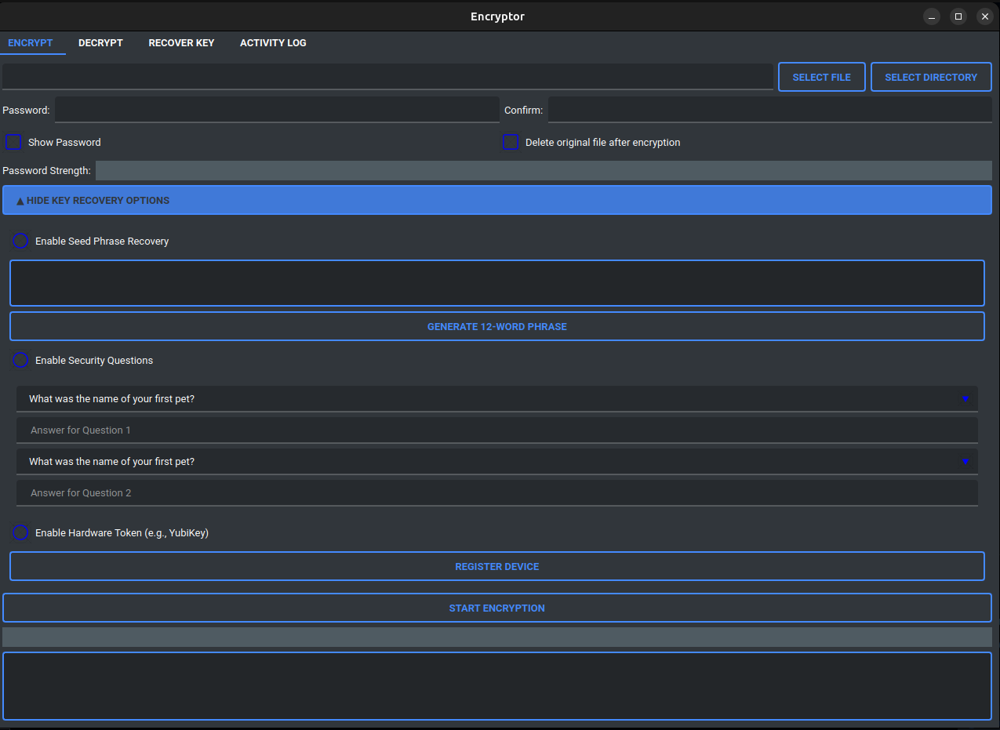

# 🔒 Secure File Encryptor/Decryptor 🛡️

A secure and user-friendly GUI tool for file encryption and decryption using military-grade AES-GCM encryption.

---

## 🌟 Description

Secure File Encryptor/Decryptor is designed to protect your sensitive files with state-of-the-art encryption. It ensures data integrity and security while offering a simple and intuitive interface.

---

## ✨ Features

- **🔐 Encryption**: AES-GCM 256-bit encryption (NSA-approved).
- **🔓 Decryption**: Authenticated decryption with tamper detection.
- **📁 Large File Support**: Handles files up to 10GB with chunked processing.
- **🖥️ GUI**: Beautiful PyQt5 interface with a dark theme.
- **🔑 Security**: PBKDF2-HMAC-SHA256 with 600,000 iterations for password hashing.

---

## 📦 Requirements

- **🐍 Python Version**: 3.10+ (Recommended: 3.10.16).
- **💻 Supported Systems**: Windows, macOS, Linux.
- **📚 Dependencies**:
    - `PyQt5`
    - `cryptography`
    - `qt_material`
    - `mnemonic==0.20`
    - `Unidecode==1.3.6`
    - `pyserial`

### Installation

Run the following command to install the required dependencies:

```bash
pip install PyQt5 cryptography qt_material mnemonic==0.20 Unidecode==1.3.6 pyserial
```

---

## 📋 Usage Guide

### 🔒 Encryption

1. Click **"Select File"**.
2. Set the output path (e.g., `.encrypted`).
3. Enter a password and confirm it.
4. Click **"Start Encryption"**.
5. Wait for the process to complete ✅.

### 🔓 Decryption

1. Click **"Select Encrypted File"**.
2. Set the output path for the decrypted file.
3. Enter the original password.
4. Click **"Start Decryption"**.
5. Retrieve your original file ✅.

### ⚠️ Important Notes

- Never lose your password!
- Keep backups of important files.
- Cancel operations by closing the application window.

---

## ⚙️ Technical Specifications

- **🛠️ Algorithm**: AES-GCM (Authenticated Encryption).
- **🔑 Key Size**: 256-bit (Military Grade).
- **🔄 Iterations**: 600,000 (NIST Recommended).
- **🧩 Chunk Size**: 1MB (Optimal Performance).
- **🧂 Salt Size**: 16 bytes.
- **🔢 Nonce Size**: 12 bytes.

---

## 🔐 Security Notes

- 🔄 Cryptographically secure random number generation.
- ✅ Automatic integrity verification.
- 🧹 Cleanup on failure.
- 🛡️ Protection against common attacks.

---

## 📜 License

This project is licensed under the **MIT License**. Free for everyone to use and modify.

---

## 📸 Preview



---

## ☕ Support

If you find this project helpful, consider supporting me:

[Buy Me a Coffee](https://www.buymeacoffee.com/logand)  
<a href="https://www.buymeacoffee.com/logand166"></a>